# Pathmap as a Collection
A simplistic way to begin describing [PathMap] is as a collection type, with an interface and behaviors similar to the std collections like [HashMap], etc.  `PathMap` keys can be any type that is interpretable as a string of bytes, and its value type is a generic type parameter implementing `Clone + Send + Sync`.  A value can be set at any unique path and then retrieved.

Therefore `PathMap<V>` has a superset of the functionality offered by `HashMap<Vec<u8>, V>`.

```rust
let mut map = PathMap::new::<usize>();
map.insert(b"arrow", 0);
map.insert(b"bow", 1);
map.insert(b"cannon", 2);
```

<p align="center">
  <object type="image/svg+xml" data="images/1.00.00_simple.svg" style="width:30%;"></object>
</p>

## The Power of Paths
Unlike hashable keys, paths have the property that they are fractal.  That is, one path may be a prefix to another path, and therefore any path may prefix the contents of an entire tree (or [trie](https://en.wikipedia.org/wiki/Trie)) of paths beneath it.

This property allows for composition, where for example, one map can be embedded, aka [grafted](GOAT, link to graft in docs) within another, or a subtree from a map can be removed or copied to a stand-alone map with a single operation.

```rust
let mut sub_map = PathMap::new();
sub_map.insert(b"arrow", ());
sub_map.insert(b"bow", ());
sub_map.insert(b"cannon", ());

let mut map = PathMap::new();
map.insert(b"armor:shield", ());
map.insert(b"armor:helmet", ());
let mut wz = map.write_zipper();
wz.descend_to(b"weapons:");
wz.graft_map(sub_map);
```

<p align="center">
  <object type="image/svg+xml" data="images/1.00.00_grafting.svg" style="width:40%;"></object>
</p>

## Structural Sharing
Storage inside `PathMap` makes use of references that can point to data within the same map or across multiple maps.  This means that it is possible to construct a map with far more values than could fit in memory if they were all stored individually.

For example, below is a diagram representating a map that contains every possible 4-byte-long path composed of the characters `['a', 'b', 'c', 'd']`.  As you can see in the graph, 16 path bytes are stored within the structure.  Without structural sharing, it would be necessary to store 256 bytes (`4^4`) to represent the same tree.

<!--  -->
<p align="center">
  <object type="image/svg+xml" data="images/1.00.00_structural_sharing.svg" style="width:50%;"></object>
</p>

For a real-world example, see the [OEIS](https://oeis.org/) section in the [Examples section (GOAT, fix this link)].

NOTE: The `viz` feature of the crate provides tools to vizualize and inspect tries with their structural sharing.